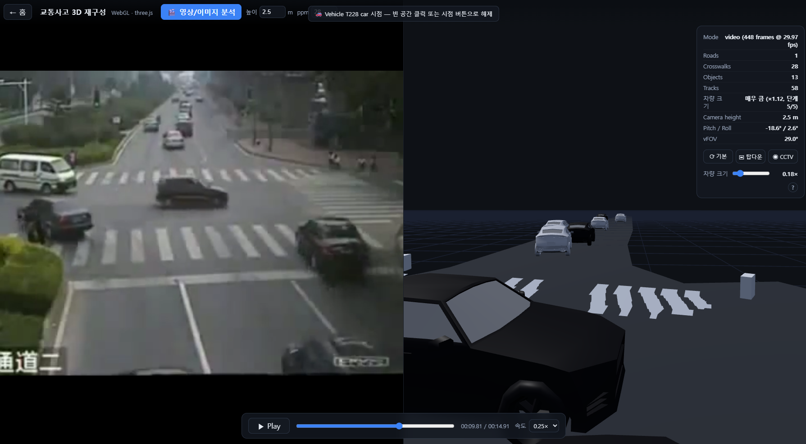
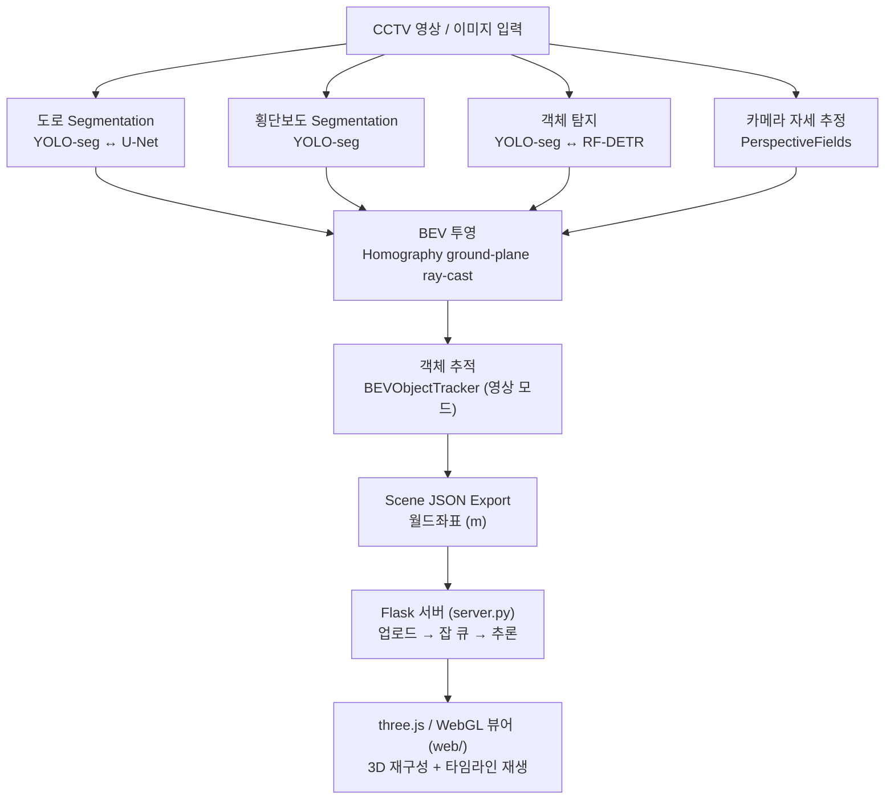
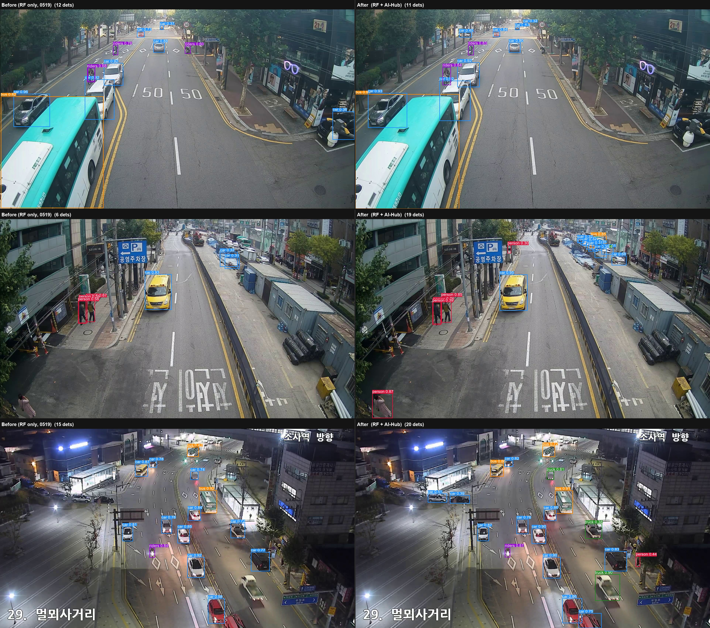

# 🚗 Road Accident Analysis — CCTV 영상 기반 교통사고 3D 재구성

> **2D CCTV 영상 한 장(또는 영상)** 만으로 도로·차량·궤적을 추출하고,
> **BEV(Bird's-Eye-View) 월드 좌표(m)** 로 변환해 **브라우저 three.js/WebGL 뷰어**에서
> 교통사고 현장을 3차원으로 재구성하는 딥러닝 파이프라인.

<p align="center">
  
  
  
  
  
  
  
</p>

<p align="center">
  <em>CCTV 원본(좌) → 동일 장면을 미터 단위 월드 좌표로 복원한 3D 뷰어(우). 영상 타임라인과 동기 재생된다.</em>
</p>



---

## 📑 목차

1. [개요](#1-개요)
2. [데모](#2-데모)
3. [핵심 기능](#3-핵심-기능)
4. [아키텍처](#4-아키텍처)
5. [데이터셋](#5-데이터셋)
6. [모델](#6-모델)
7. [학습 & 평가](#7-학습--평가)
8. [실험](#8-실험)
9. [웹 뷰어](#9-웹-뷰어)
10. [배포](#10-배포)
11. [빠른 시작](#11-빠른-시작)
12. [프로젝트 구조](#12-프로젝트-구조)
13. [활용 방안 & 향후 과제](#13-활용-방안--향후-과제)

---

## 1. 개요

교통사고 분석은 본질적으로 **3차원 문제**다. 차량 간 거리, 충돌 지점, 차선 이탈 여부는
2D 영상만으로는 정량화하기 어렵다. 이 프로젝트는 **단안(monocular) CCTV 영상**을 입력으로 받아
다음을 자동으로 추출/복원한다.

- 🛣️ **도로 / 횡단보도 영역** (semantic segmentation)
- 🚙 **차량·보행자 객체** + 발끝 좌표(footpoint) (object detection)
- 📐 **카메라 자세** (roll / pitch / vFOV) — 별도 캘리브레이션 없이 단일 이미지에서 추정
- 🗺️ **BEV 월드 좌표(미터)** 로의 투영 + **객체 추적·궤적**
- 🧊 **three.js 3D 씬** 으로의 재구성 및 영상 동기 재생


| | |
|---|---|
| **입력** | 단일 이미지 / 영상 (CCTV, 고정 카메라 가정) |
| **출력** | 월드좌표(m) scene JSON + BEV 추적 영상 + 3D WebGL 뷰어 |
| **핵심 가정** | 평평한 지면(flat-ground), 정적 카메라 |
| **배포 형태** | ① Flask 추론 서버(업로드→추론→시각화) ② 정적 뷰어(GitHub Pages, 추론 불필요) |

---

## 2. 데모

### 2.1 업로드 → 추론 → 3D 시각화

웹 페이지에서 영상/이미지를 업로드하면 Flask 서버가 추론해 scene JSON을 반환하고,
three.js 뷰어가 도로·차량·궤적을 3D로 재구성한다. 좌측 원본 영상과 우측 3D 씬은 **타임라인 동기 재생**된다.


### 2.2 산출물

| 산출물 | 경로 | 설명 |
|---|---|---|
| Scene JSON | `output/<name>_scene.json` | 월드좌표(m) 도로·객체·궤적·프레임별 위치 |
| BEV 추적 영상 | `output/<name>_tracked_bev.mp4` | Bird's-Eye-View 캔버스에 도로/궤적/객체 렌더 |
| 웹 미러 | `web/data/scene_data.json` | 정적 뷰어가 자동 로드하는 기본 씬 |

> 🎞️ **데모 영상 (텍스트 노트)**: `output/sample1_tracked_bev.mp4`, `output/sample2_tracked_bev.mp4`,
> `output/sample3_tracked_bev.mp4` 에 BEV 추적 영상이 포함되어 있다(GitHub 마크다운에 인라인 임베드 불가 — 직접 재생).

---

## 3. 핵심 기능

- **단안 카메라 자세 추정** — [PerspectiveFields](https://github.com/jinlinyi/PerspectiveFields)로 roll/pitch/vFOV를 추정해
  **수동 캘리브레이션 없이** 단일 이미지에서 BEV 투영을 가능케 함.
- **Homography 기반 BEV 투영** — 각 UV 픽셀을 카메라 높이의 지면으로 ray-cast → 실세계 좌표(m).
- **교체 가능한 백엔드** — 도로 분할(`yolo` ↔ `unet`)·객체 탐지(`yolo` ↔ `rfdetr`)를 `PipelineConfig` 플래그로 토글.
  무거운 의존성은 **선택한 백엔드일 때만 지연 import**.
- **세계 좌표 기반 객체 추적** — `BEVObjectTracker`: greedy nearest-neighbor + 클래스 일치 + re-ID + 궤적 deque.
- **정적 카메라 최적화** — 영상 모드에서 도로 분할·카메라 추정을 **첫 프레임 1회만** 수행(CCTV 고정 가정).
- **차체 색상 추정** — 차량 픽셀 명도로 흑/백 판정 → 뷰어가 GLB 페인트 재질을 색별로 교체.
- **빌드리스 웹 뷰어** — importmap + CDN three.js. 번들 단계 없이 `web/`를 정적 호스팅 가능.
- **CPU 가속 옵션** — `export_onnx.py`로 U-Net/crosswalk 모델을 ONNX Runtime 실행(CPU 1.5–2.5×).

---

## 4. 아키텍처

### 4.1 전체 파이프라인



### 4.2 파이프라인 단계

| # | 단계 | 함수 / 클래스 | 출력 |
|---|---|---|---|
| 1 | 도로 분할 | `RoadSceneProjector._infer_road()` | UV polygon |
| 2 | 횡단보도 분할 | `infer_crosswalk_model()` | UV polygon |
| 3 | 객체 탐지 | `infer_object_model()` / RF-DETR | bbox + footpoint |
| 4 | 카메라 추정 | `estimate_camera_params()` | roll / pitch / vFOV |
| 5 | BEV 투영 | `project_uv_to_ground()` → `world_to_bev()` | 월드좌표(m) → 캔버스 픽셀 |
| 6 | 추적 (영상) | `BEVObjectTracker` | track_id, 속도, 궤적 |
| 7 | Export | `export_scene_json()` → `write_scene_json()` | scene JSON |

### 4.3 핵심 진입점

| 심볼 | 파일 | 역할 |
|---|---|---|
| `PipelineConfig` | `infer.py` | 모델 경로·confidence·BEV·추적·백엔드 토글 등 모든 설정 |
| `RoadSceneProjector` | `infer.py` | 세 모델 + PerspectiveFields 로드, `run()` / `run_video()` 소유 |
| `BEVObjectTracker` | `infer.py` | BEV 세계 좌표 greedy 추적기 |
| `render_bev_scene` | `infer.py` | BEV 캔버스 렌더(도로/횡단보도/궤적/객체) |
| `run_pipeline` / `run_video_pipeline` | `infer.py` | 이미지/영상 엔트리. `main.py`가 CLI로 래핑 |

> **좌표계**: 월드 `(x_m, z_m)` → three.js `(x, 0, z)`, Y-up. X=좌우, Z=전방 깊이, 지면 Y=0(flat-ground).
> 객체 heading은 모션 벡터를 `Quaternion.setFromUnitVectors(+Z, dir)`로 적용.

---

## 5. 데이터셋

| 데이터셋 | 출처 | 용도 | 포맷 / 규모 |
|---|---|---|---|
| `cctv-roadseg-dataset` | [Roboflow](https://universe.roboflow.com/road001/road-segmentation-cctv) | 도로 segmentation | YOLO-seg polygon, 640×640 · train 3,153 / val 214 / test 135 |
| `cctv-crosswalk-dataset` | [Roboflow](https://universe.roboflow.com/answer-l-wnpxb/0415) | 횡단보도 segmentation | YOLO-seg polygon |
| `cctv-object-dataset` | Roboflow | 객체 탐지 (5클래스) | train 608 / val 164 / test 83 (5,229 boxes) |
| `cctv-object-dataset-aihub` | [AI-Hub 교통영상(시내도로)](https://aihub.or.kr/aihubdata/data/view.do?dataSetSn=165) | 객체 탐지 증강 | 원본 ~13.5만 장 / 79 GB, FHD·HD 혼재 |
| 사고 테스트셋 | [Kaggle](https://www.kaggle.com/datasets/webadvisor/real-time-anomaly-detection-in-cctv-surveillance) · [CarCrash](https://ankitshah009.github.io/accident_forecasting_traffic_camera) | 추론 정성 평가 | — |

> 데이터셋 파일은 용량이 커서 레포에 포함하지 않는다(gitignore). 링크는 `datasets.txt` 참조.
> **객체 클래스 체계 통일**: `bus · car · person · riders · truck` (5종). AI-Hub 8종 → 5종 매핑.

---

## 6. 모델

| 역할 | 모델 | 비고 |
|---|---|---|
| 도로 분할 | **U-Net (SMP, resnet34)** *(기본)* / YOLO26-seg | `road_detector_type` 토글 · [실험 §8.1](#81-도로-분할-u-net-vs-yolo-seg) |
| 횡단보도 분할 | YOLO26-seg | class index 1만 사용 |
| 객체 탐지 | **RF-DETR Nano** *(기본)* / YOLO26-seg | `object_detector_type` 토글 · [실험 §8.2](#82-객체-탐지-ai-hub-데이터-증강) |
| 카메라 자세 | PerspectiveFields (`Paramnet-360Cities-edina-centered`) | vFOV 미검출 시 65° 기본값 |
| 차량 렌더 | GLB (`web/assets/coupe.glb`) | 색상별 페인트 재질 교체, 실세계 크기 정규화 |

학습 시작 가중치: `yolo26l-seg.pt`(도로/횡단보도), `yolo26s-seg.pt`(객체), `rf-detr-nano.pth`(COCO 사전학습).

---

## 7. 학습 & 평가

```bash
conda activate dl

# YOLO-seg 학습
python train.py --model road        # 도로
python train.py --model crosswalk   # 횡단보도
python train.py --model object      # 객체

# U-Net 도로 분할 학습 (약 14분 @ RTX 5070 Ti)
python train_road_smp.py --epochs 30 --batch 12 --imgsz 512

# RF-DETR 객체 탐지 학습
python train.py --model rfdetr-object --dataset datasets-rfdetr/augmented --rfdetr-size nano --epochs 50
```

- **공통 학습 환경**: NVIDIA RTX 5070 Ti (17 GB), torch 2.10.0+cu128, `dl` conda env.
- **CCTV 특화 augmentation**: HSV-V 조도 변화(야간·역광), 소폭 회전(±5°, 고정 카메라), shear(미세 원근).
- 학습 결과는 `runs/segment/<run>/weights/best.pt`, `runs/smp-road/best.pt`, `runs/rfdetr/<run>/`에 저장.

### U-Net 도로 분할 학습 곡선 — 1 epoch 만에 val IoU 0.92, 0.97로 수렴


---

## 8. 실험

두 건의 **통제된 비교 실험**으로 파이프라인의 핵심 단계 설계를 정량 검증했다.

### 8.1 도로 분할: U-Net vs YOLO-seg

**가설** — 도로는 단일·연속·대면적 시맨틱 클래스이므로 인스턴스 분할(YOLO)보다
dense semantic segmentation(U-Net)이 구조적으로 더 적합하다.

같은 데이터셋·같은 test 135장·같은 GT(YOLO polygon 래스터화)로 픽셀 단위 비교:

| 모델 | params | mean IoU | mean Dice | pixel acc | 지연(ms/img) |
|---|---:|---:|---:|---:|---:|
| YOLO-seg `0401` (구 기본값) | 11.4M | 0.7829 | 0.8337 | 0.8806 | ~17–23 |
| YOLO-seg `0405` (대형) | 31.4M | 0.8752 | 0.9081 | 0.9262 | ~26 |
| **U-Net resnet34** | 24.4M | **0.9632** | **0.9801** | **0.9808** | **~15** |

> **결론**: U-Net이 **모든 픽셀 지표에서 큰 폭 우세**(기본 YOLO 대비 IoU **+0.18**, 대형 YOLO 대비 **+0.09**)
> 하면서 **지연시간은 더 짧다**. 더 큰 YOLO(31M)조차 더 작은 U-Net(24M)에 뒤지므로, 격차는 용량이 아닌
> **작업 적합성**(dense semantic vs instance)에서 비롯된다. → 도로 단계 **기본값을 U-Net으로 채택**.

정성 비교 — `입력 | GT(초록) | YOLO(주황) | U-Net(파랑)`. YOLO는 원거리·가장자리에서 under-segment, U-Net은 더 완전히 덮음:


### 8.2 객체 탐지: AI-Hub 데이터 증강

**가설** — 대규모 한국 CCTV(AI-Hub) 데이터를 기존 Roboflow 데이터에 증강하면,
기존 도메인을 희생하지 않으면서 탐지 성능이 오른다.

동일 RF-DETR(Nano) 구조·하이퍼파라미터로 **baseline**(Roboflow only)과
**augmented**(Roboflow + AI-Hub 2×)를 학습, **완전히 동일한 held-out test 333장**으로 평가:

| 도메인 (이미지 수) | baseline mAP@50:95 | augmented mAP@50:95 | 변화 |
|---|---:|---:|---:|
| **전체** (333) | 0.2534 | **0.3667** | **+44.7 %** |
| RF 도메인 (83) | 0.5294 | **0.5370** | +1.4 % |
| AI-Hub 도메인 (250) | 0.2112 | **0.3390** | **+60.5 %** |

클래스별(AI-Hub 도메인) — 희소 클래스가 가장 크게 개선:

| 클래스 | baseline | augmented | 변화 |
|---|---:|---:|---:|
| truck | 0.1109 | **0.2994** | **+170 %** |
| person | 0.0466 | **0.1098** | **+136 %** |
| bus | 0.3161 | **0.5077** | +61 % |
| riders | 0.2222 | **0.3020** | +36 % |
| car | 0.3602 | **0.4758** | +32 % |

> **결론**: 원본의 단 **0.8 %**(2×)만 추가해도 AI-Hub 도메인이 **+60.5 %** 오르고 기존 RF 도메인은
> **유지(+1.4 %)** — catastrophic degradation 없음. 데이터가 부족했던 truck(114→1,525 box)·bus·person의
> 보강 효과가 두드러진다.

정성 비교 — Before(RF only) vs After(RF + AI-Hub). 야간 장면에서 탐지 객체 8개 → 20개로 증가:



---

## 9. 웹 뷰어

`web/` — three.js/WebGL 기반, **빌드 스텝 없음**(importmap + CDN three.js@0.169).

| 모듈 | 역할 |
|---|---|
| `main.js` | 렌더러·씬·조명·카메라·OrbitControls, scene 로드, `applyScene` 분기 |
| `src/sceneData.js` | JSON 헬퍼(`hasTimeline`, `objectWorld`, `describeScene`) |
| `src/roadBuilder.js` | polygon → 삼각분할 메시 |
| `src/vehicleFactory.js` | car=GLB(색상별 재질 교체), truck/bus=박스, person=캡슐 |
| `src/objectPlacer.js` · `trajectoryRenderer.js` | 정적 모드 배치 + 궤적 라인 |
| `src/playback.js` | 영상 타임라인(프레임 보간, 최소제곱 heading, play/seek/loop/speed) |
| `src/ui.js` | 업로드·드래그드롭·재생바·뷰 프리셋 |

- **이미지 씬** (`frames` 없음) → 객체 정적 배치 + 궤적 라인
- **영상 씬** (`frames` + `fps`) → 타임라인 재생(차량이 프레임 따라 이동)
- 기존 scene JSON은 "JSON 열기" / 드래그드롭 / `?scene=<url>`로 로드 (서버 불필요)

상세: [`docs/webgl_threejs_viewer.md`](docs/webgl_threejs_viewer.md)

---

## 10. 배포

### 10.1 Flask 추론 서버 (업로드 → 추론 → 시각화)

```bash
conda activate dl
pip install -r requirements-server.txt   # flask, imageio, onnxruntime
python server.py                          # → http://localhost:5000
```

- `RoadSceneProjector`를 **하나만 로드해 재사용**, 추론은 **단일 워커 큐로 직렬화**(torch 모델 동시 실행 비안전).
- `POST /api/infer`(업로드→잡 큐) → `GET /api/jobs/<id>`(폴링) → 자동 시각화. 업로드 512 MB 제한.

### 10.2 AWS ECS Fargate (Docker)

`Dockerfile` + `task-definition.json` + `deploy.ps1`로 컨테이너화하여 **ECR → ECS 롤링 배포**.
ALB 뒤에서 서비스되며, 미사용 시 `desired-count 0`으로 Fargate 비용 절감. 상세: [`DEPLOY.md`](DEPLOY.md)

### 10.3 정적 뷰어 (GitHub Pages, 추론 불필요)

```bash
cd web && python -m http.server 8000      # → http://localhost:8000
```

`.github/workflows/deploy-pages.yml`이 `web/`를 Pages 아티팩트로 업로드 → `https://<user>.github.io/<repo>/`.
번들 샘플 자동 로드 + JSON 열기/드래그드롭만 동작(업로드 추론 비활성).

---

## 11. 빠른 시작

```bash
# 0) 환경 (cv2/torch/ultralytics가 설치된 dl conda env)
conda activate dl

# 1) 이미지 추론
python main.py --image input/image1.png --output-dir output

# 2) 영상 추론
python main.py --video input/video1.mp4 --output-dir output

# 3) 백엔드 토글 / 카메라 파라미터
python main.py --image input/image1.png \
  --use-unet-road --use-rfdetr-object \
  --camera-height 6.5 --ppm 42.0

# 4) 웹 앱 (업로드 → 추론 → 3D)
python server.py            # → http://localhost:5000
```

> ⚠️ 모든 Python 명령은 `dl` conda 환경에서 실행한다(`cv2`·`torch`·`ultralytics`·`perspective2d` 의존).


---

## 12. 프로젝트 구조

```
RoadAccidentAnalysis/
├── infer.py                # 전체 추론 로직 (PipelineConfig, RoadSceneProjector, BEVObjectTracker, export)
├── main.py                 # CLI 래퍼 (이미지/영상 모드)
├── server.py               # Flask: 정적 서빙 + 업로드 추론 API (잡 큐)
├── train.py                # YOLO-seg / RF-DETR 학습
├── train_road_smp.py       # U-Net(SMP) 도로 분할 학습
├── eval_road_smp.py        # U-Net vs YOLO 비교 평가
├── export_onnx.py          # U-Net/crosswalk → ONNX (CPU 가속)
├── smp_road/               # U-Net dataset / model 모듈
├── util/                   # 라이브 CCTV·AI-Hub 전처리·RF-DETR 평가 스크립트
├── web/                    # three.js/WebGL 뷰어 (빌드리스)
│   ├── index.html · main.js · styles.css
│   ├── src/                # sceneData·roadBuilder·vehicleFactory·objectPlacer·playback·ui
│   ├── assets/             # GLB 차량/사람 모델
│   └── data/               # 샘플 scene JSON + 영상
├── docs/                   # 실험 보고서 + 뷰어 문서 + 에셋
│   ├── unet_vs_yolo_roadseg.md
│   ├── rfdetr_aihub_experiment.md
│   ├── webgl_threejs_viewer.md
│   └── assets/             # README/보고서 임베드 이미지
├── runs/                   # 학습 산출물 (gitignore)
├── Dockerfile · DEPLOY.md  # AWS ECS 배포
└── CLAUDE.md               # 코드베이스 가이드
```

---

## 13. 활용 방안 & 향후 과제

### 활용 방안

- **사고 원인 분석** — 차량 간 거리·충돌 지점·차선 이탈을 미터 단위로 정량화.
- **시나리오 시뮬레이션** — 복원된 3D 씬에서 시점/속도를 바꿔가며 재현.
- **교통 흐름 분석** — BEV 궤적으로 통행량·정체·위험 구간 도출.
- **시각화 전용 배포** — 추론 서버 없이 정적 호스트에 scene JSON만 올려 3D 리포트로 공유.

### 향후 과제

- **속도 추정** — 프레임 간 BEV 변위로 객체 실속도(km/h) 산출 *(부분 구현: `vx_m`·`vz_m`)*.
- **차량 세분류** — 차종·색상 세분화(현재 흑/백 + 5클래스).
- **도메인 갭 해소** — 한국 CCTV 라벨로 도로 분할 전이학습(현재 최대 불확실성).
- **뷰어 고도화** — 차종별 GLTF 확장, 충돌 지점 하이라이트.
- **카메라 추정 정밀화** — flat-ground 가정 완화, BEV 거리 정확도 개선.

---

<p align="center"><sub>22011807 최재현 · CCTV 영상 기반 교통사고 3D 재구성 딥러닝 실습 프로젝트</sub></p>
