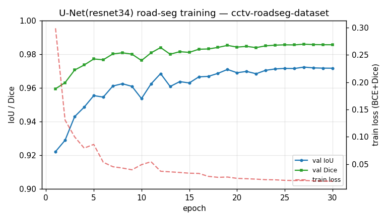
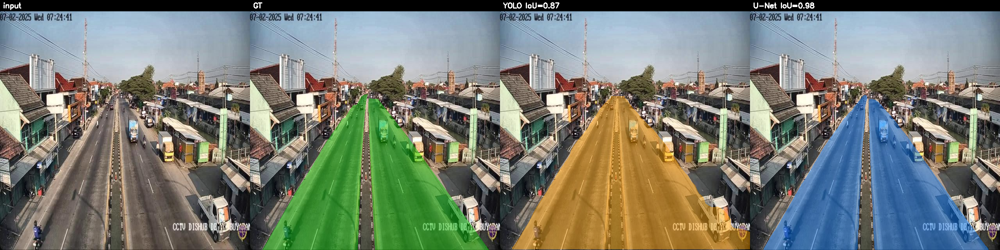
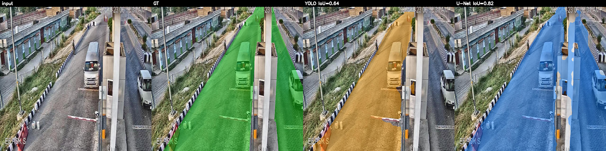

# 도로 Segmentation: U-Net(SMP) vs YOLO-seg 비교 실험 보고서

작성: 2026-06-20 · 브랜치 `feature/unet-roadseg-smp`
대상: `infer.py` 파이프라인의 **도로 segmentation 단계**를 U-Net 으로 교체했을 때의 효과 검증

---

## 1. TL;DR (요약)

같은 데이터셋(`cctv-roadseg-dataset`)·같은 test 셋(135장)·같은 GT(YOLO polygon 라벨 래스터화)로
**U-Net(SMP, resnet34 인코더)** 을 새로 학습해 기존 **YOLO-seg** 도로 모델과 픽셀 단위로 비교했다.

| 모델 | params | mean IoU | mean Dice | pixel acc | GPU 지연(ms/img) |
|---|---:|---:|---:|---:|---:|
| YOLO-seg `0401-road` (파이프라인 기본) | 11.4M | 0.7829 | 0.8337 | 0.8806 | ~17–23 |
| YOLO-seg `0405-road` (더 큰 모델) | 31.4M | 0.8752 | 0.9081 | 0.9262 | ~26 |
| **U-Net resnet34 (신규)** | 24.4M | **0.9632** | **0.9801** | **0.9808** | **~15** |

- **U-Net 이 모든 픽셀 지표에서 큰 폭으로 우세**하다. 파이프라인 기본 YOLO 대비 **mean IoU +0.18 (0.78→0.96)**,
  더 큰 YOLO(`0405`)와 비교해도 **+0.09 (0.88→0.96)**.
- 더 작은 입력 해상도(512)로도 **지연시간이 더 짧다**(단일 forward pass).
- 결론: 이 과제의 도로 단계에서는 **U-Net 전환이 정량적으로 명확히 유리**하다. 다만 학습 데이터 도메인
  (동남아/인도 거리)과 실제 파이프라인 입력(한국 교차로 CCTV)의 **도메인 갭**이 공통 한계로 남는다(§7).

---

## 2. 동기 — 왜 U-Net 을 검토했나

기존 파이프라인은 도로/횡단보도/객체를 모두 YOLO-seg(인스턴스 분할)로 처리한다. 그러나 도로는:

- **단일 시맨틱 클래스**(road / not-road)이고 인스턴스 구분이 필요 없다. 파이프라인도
  `_extract_road_polygons()` 로 모든 폴리곤을 합쳐서 쓴다(인스턴스 정보 미사용).
- 화면을 크게 차지하는 **연속 영역**이라, 인스턴스 anchor/NMS 기반보다 **픽셀 dense prediction**
  (U-Net)이 구조적으로 더 적합하다.
- 도로 마스크는 BEV 투영의 기준면이자 `filter_outside_road`(footpoint 필터)의 근거라
  **경계 정확도가 곧 후속 단계 정확도**다.

U-Net 의 출력은 binary mask 이지만, `mask_to_polygons()` 로 `findContours` 하면 기존
`infer_road_model()` 의 반환 형식(`road_polygons_uv`)과 호환된다 → **나머지 파이프라인 무수정 교체 가능**.

---

## 3. 실험 설정

### 3.1 데이터셋
`cctv-roadseg-dataset` (Roboflow, 단일 클래스 `road`, YOLO-seg polygon 포맷, 640×640)

| split | 이미지 수 |
|---|---:|
| train | 3,153 |
| valid | 214 |
| test | 135 |

- **GT 정의**: YOLO polygon 라벨을 `cv2.fillPoly` 로 래스터화한 0/1 마스크. 두 모델 모두 **동일한 GT**로 채점하므로 공정하다.
- U-Net 학습 마스크도 같은 방식으로 생성(`smp_road/dataset.py::rasterize_yolo_polygons`).

### 3.2 모델 / 학습
| 항목 | 값 |
|---|---|
| 아키텍처 | `smp.Unet`, encoder `resnet34` (ImageNet 사전학습) |
| 파라미터 | 24.44M |
| 입력 해상도 | 512×512 |
| Loss | Dice + BCEWithLogits |
| Optimizer | AdamW (lr 3e-4, wd 1e-4), CosineAnnealingLR |
| Augmentation | HFlip, RandomBrightnessContrast(±0.3), Affine(scale±10%, shift 5%, rot±5°) — CCTV 조도/미세원근 대응 |
| Epochs / batch | 30 / 12, AMP(fp16) |
| 환경 | RTX 5070 Ti, torch 2.10+cu128, `dl` conda env |
| 학습 시간 | **약 14분** (안정화 후 ~27s/epoch) |
| 최고 성능 | **val IoU 0.9724 @ epoch 27** → `runs/smp-road/best.pt` |

학습 곡선(빠른 수렴 — 1 epoch 만에 val IoU 0.92, 이후 0.97 수렴):



### 3.3 비교 대상 YOLO 모델
- `runs/segment/0401-road/weights/best.pt` — **파이프라인 기본값**(`infer.DEFAULT_ROAD_MODEL_PATH`), 11.4M params
- `runs/segment/0405-road/weights/best.pt` — 더 큰 변형, 31.4M params (참고용 강한 기준선)

### 3.4 평가 방법 (`eval_road_smp.py`)
- test 135장 각각: GT 마스크 vs 각 모델 예측 마스크의 **IoU / Dice / pixel accuracy** 평균.
- YOLO 예측은 파이프라인과 동일하게 **polygon → 원본 해상도 래스터화** 후 채점(`conf=0.25`).
- 지연시간은 GPU warmup 후 모델 호출 구간만 측정.

---

## 4. 정량 결과

### 4.1 핵심 비교 (test 135장, native 640, conf 0.25)

| metric | YOLO `0401` | YOLO `0405` | **U-Net** | U-Net − 최선 YOLO |
|---|---:|---:|---:|---:|
| mean IoU | 0.7829 | 0.8752 | **0.9632** | **+0.0880** |
| mean Dice | 0.8337 | 0.9081 | **0.9801** | **+0.0720** |
| pixel acc | 0.8806 | 0.9262 | **0.9808** | **+0.0546** |
| 지연(ms) | ~17–23 | ~26 | **~15** | 더 빠름 |
| params | 11.4M | 31.4M | 24.4M | — |

> 더 큰 YOLO(`0405`, 31M)조차 더 작은 U-Net(24M)에 IoU 0.088 뒤진다. 즉 격차는 단순 용량 차이가 아니라
> **작업 적합성(dense semantic vs instance)** 차이로 보는 것이 타당하다.

### 4.2 공정성 검증 — YOLO 추론 해상도

YOLO 도로 모델은 `imgsz=1280` 으로 학습됐으나 test 이미지는 native 640 이다. 해상도 매칭이 YOLO 에
유리한지 확인하기 위해 `imgsz=1280` 으로도 평가했다:

| YOLO `0401` 추론 해상도 | mean IoU |
|---|---:|
| **640 (native, 파이프라인 기본)** | **0.7829** ← 채택 |
| 1280 (학습 해상도 매칭) | 0.4140 (오히려 악화) |

native 640 으로 추론할 때 YOLO 가 **가장 좋다**(1280 은 640 이미지를 2× 업스케일하며 마스크가 깨짐).
따라서 비교에는 YOLO 에 **가장 유리한** 640 결과를 사용했다 — U-Net 우위는 보수적으로 평가된 수치다.

---

## 5. 정성 결과

패널 구성: `입력 | GT(초록) | YOLO(주황) | U-Net(파랑)`. 전체는 `runs/smp-road/compare/` 참조.

**test 셋 예시 A** — YOLO·U-Net 모두 도로 본체는 잡지만 U-Net 경계가 GT 에 더 밀착:


**test 셋 예시 B** — YOLO 는 원거리/얇은 도로 영역을 누락(under-segment), U-Net 은 더 완전히 덮음:


**관찰 요약**
- YOLO 의 주된 오류는 **under-segmentation**: 원거리·가장자리·그림자 영역을 빠뜨려 IoU 손실.
- U-Net 은 도로 영역을 **더 완전하고 연속적으로** 채우며 경계가 매끄럽다.
- YOLO 폴리곤은 단순화로 인해 경계가 각지고, 인스턴스가 갈라지면 도로 사이에 갭이 생긴다.

---

## 6. 실제 파이프라인 입력에서의 정성 비교 (GT 없음)

`input/image1~3.png` 는 실제 파이프라인 입력(한국 교차로 야간/주간 CCTV)으로, **학습 데이터와 도메인이
다르다**(OOD). 패널 구성: `입력 | YOLO | U-Net`.


- 두 모델 모두 OOD 임에도 도로 본체를 잡아낸다.
- U-Net 마스크가 교차로/연결도로 형상을 더 충실히 따라가고, YOLO 는 인도/배경으로 약간 번지거나
  교차 도로를 누락하는 경향.
- **단, 정량 수치는 test 도메인 기준**이며 실제 한국 CCTV 에서의 절대 성능은 별도 라벨 없이 단정할 수 없다(§7).

---

## 7. 한계 및 주의점 (객관적 평가)

1. **도메인 갭**: train/test 는 Roboflow(동남아·인도계 거리)이고 실제 입력은 한국 CCTV 다. §4 수치는
   *test 도메인 내* 결과이며, 실제 운영 도메인 성능은 한국 CCTV 라벨로 재검증해야 한다. 이 갭은 YOLO·U-Net
   **공통 한계**이지 U-Net 고유 문제는 아니다.
2. **GT 의 기준**: GT 자체가 YOLO 포맷 폴리곤이라 "정답"이 폴리곤 수준 granularity 다. 픽셀 dense 한
   U-Net 이 약간 유리할 여지가 있으나, 두 모델 동일 GT 채점이므로 상대 비교는 유효하다.
3. **인스턴스 정보 상실**: U-Net 은 road/not-road 이진 분류라 도로 인스턴스를 구분하지 못한다. 단,
   파이프라인이 이미 모든 도로 폴리곤을 합쳐 쓰므로 **실질 손실 없음**.
4. **신뢰도 점수 부재**: YOLO 는 인스턴스별 conf 가 있으나 U-Net 은 픽셀 확률 + threshold 방식이다.
   필요 시 sigmoid 확률맵으로 신뢰도를 대체할 수 있다.
5. **체크포인트 크기**: U-Net `best.pt` 97.9MB(fp32 24.4M params) vs YOLO 23–63MB. fp16 저장 시 절반으로 축소 가능.
6. **BEV 정확도 병목**: 현재 파이프라인 최대 오차원은 카메라 파라미터 추정과 flat-ground 가정이다.
   도로 마스크 정밀도 향상은 `filter_outside_road` 정확도와 도로 표면 렌더 품질을 직접 개선하지만,
   BEV 거리 정확도 자체는 카메라 추정 개선과 병행해야 체감된다.

---

## 8. 파이프라인 통합 방법

U-Net 출력을 기존 인터페이스에 맞췄기 때문에 `infer.py` 의 **도로 단계만** 교체하면 된다.

```python
# infer.py (개념 예시)
from smp_road.model import load_checkpoint, infer_road_polygons

# RoadSceneProjector.__init__ 에서 1회 로드
self.road_unet, _ = load_checkpoint("runs/smp-road/best.pt", device=self.device)

# 기존 infer_road_model(...) 호출 대신:
road_out = infer_road_polygons(self.road_unet, image_bgr, imgsz=512, device=self.device)
# road_out["road_polygons_uv"] 형식 동일 → 이후 BEV 투영/마스크 필터 무수정
```

- 정적 카메라 영상 모드에서는 도로 단계가 첫 프레임 1회만 실행되므로 추론 비용 영향 미미.
- `PipelineConfig` 에 `road_detector_type: "yolo" | "unet"` 플래그를 두어 토글 가능하게 하는 것을 권장(객체 단계의 `object_detector_type` 패턴과 동일).

---

## 9. 결론 및 권장

- **정량적으로 U-Net 전환은 명확한 이득**이다(파이프라인 기본 YOLO 대비 IoU +0.18, 더 큰 YOLO 대비 +0.09,
  지연시간도 단축). 도로처럼 단일·연속·대면적 클래스에는 dense semantic segmentation 이 구조적으로 맞다.
- **권장 채택안**: 도로 단계를 U-Net(resnet34) 으로 교체하되 `PipelineConfig` 플래그로 토글 가능하게 유지.
- **후속 과제**:
  1. **도메인 갭 해소** — 한국 CCTV(AI HUB / ITS) 도로 마스크를 추가 라벨링·전이학습. 현재 최대 불확실성.
  2. 인코더 업스케일(`efficientnet-b3` 등) 또는 입력 640 학습으로 추가 향상 여지 확인.
  3. fp16 체크포인트 저장으로 배포 크기 축소.
  4. 횡단보도 단계도 동일 패턴으로 U-Net 화 검토(희소·소면적이라 이득은 도로보다 작을 수 있음).

---

## 재현 방법

```bash
conda activate dl
pip install segmentation-models-pytorch          # 최초 1회

# 학습 (약 14분, RTX 5070 Ti)
python train_road_smp.py --epochs 30 --batch 12 --imgsz 512
# -> runs/smp-road/best.pt, history.json

# 평가 + 비교 패널
python eval_road_smp.py \
  --yolo-model runs/segment/0401-road/weights/best.pt \
  --smp-ckpt   runs/smp-road/best.pt
# -> runs/smp-road/metrics.json, runs/smp-road/compare/*.png
```

### 산출물
| 경로 | 내용 |
|---|---|
| `smp_road/` | dataset / model 모듈 (재사용·통합용) |
| `train_road_smp.py` | U-Net 학습 스크립트 |
| `eval_road_smp.py` | U-Net vs YOLO 비교 평가 스크립트 |
| `runs/smp-road/best.pt` | 학습된 U-Net 체크포인트 (val IoU 0.9724) |
| `runs/smp-road/history.json` | epoch 별 학습 지표 |
| `runs/smp-road/metrics.json` | test 집계 지표 |
| `runs/smp-road/compare/*.png` | 정성 비교 패널 |
| `docs/assets/unet_vs_yolo/` | 본 보고서 임베드 이미지 |
